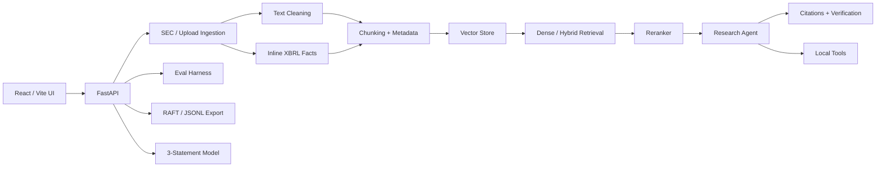

# FinLLM Research Agent

I built this because I was tired of pasting 10-Ks into chat tools and getting back confident-sounding answers with no source. The whole point here is the opposite: ingest a filing, ask a question, get an answer that points at the exact paragraph it came from.

It runs entirely on your machine by default. No API keys, no external calls, no data leaving the laptop. You can plug in OpenAI-compatible models or Ollama later if you want, but the demo path doesn't need any of that.

## What it actually does

You drop in a filing — the bundled NVIDIA 10-K sample, an SEC archive URL, a `.txt`, or a text-layer `.pdf` — and it:

- Pulls the metadata out of Inline XBRL when it can (ticker, company, form type, period).
- Cleans the text, chunks it with that metadata attached, and indexes it locally.
- Answers questions in three different retrieval modes so you can see which one behaves better on your filing: `basic_rag`, `rag_rerank`, and `self_verify`.
- Cites every claim with markers that resolve back to the exact retrieved chunk.
- Runs a small set of local tools when the question needs them: a calculator, metadata SQL, market data, ratio math, and a tiny backtest.
- Scores itself with retrieval, citation correctness, relevance, hallucination-proxy, latency, cost, and tool-success metrics.
- Exports RAFT-style examples and LoRA-format JSONL for if you ever want to actually train something on this corpus.
- Builds a source-backed three-statement modeling scaffold from XBRL facts (or extracted lines) and projects forward with a configurable growth rate.

## How the RAG flow works



In plain English:

```text
filing or upload
  -> clean text and detect metadata
  -> pull out Inline XBRL facts when present
  -> chunk with ticker / company / form / date attached
  -> embed locally (deterministic hash embeddings by default)
  -> store in an in-memory vector index
  -> retrieve evidence for the question
  -> optionally hybrid-search and rerank
  -> draft answer from retrieved chunks
  -> attach citations and verify the markers
  -> return answer, evidence, sources, confidence, and limitations
```

The default answerer is deliberately extractive. If the evidence doesn't say it, the answer doesn't say it. That sounds boring, and it kind of is — but it's the behavior I actually want from a research tool.

## Running it locally

Backend:

```powershell
py -3 -m venv .venv-win
.\.venv-win\Scripts\python.exe -m pip install -r requirements.txt
.\.venv-win\Scripts\python.exe -m uvicorn api.main:app --host 127.0.0.1 --port 8010
```

Frontend:

```powershell
cd frontend
npm install
$env:VITE_API_BASE="http://127.0.0.1:8010"
npm run dev -- --host 127.0.0.1 --port 5180 --strictPort
```

Then open `http://127.0.0.1:5180`, click the demo loader, and start asking questions.

## Docker, if you'd rather

```powershell
docker compose -f infra/docker-compose.yml up --build
```

That gives you the API on `http://127.0.0.1:8000`, the UI on `http://127.0.0.1:5173`, and a persistent local Chroma store in the `finllm-storage` Docker volume.

## The bundled sample

The demo loader ingests a NVIDIA 10-K excerpt for fiscal year ended January 25, 2026 (`examples/sample_docs/nvda_10k_2026.txt`). It's a faithful condensation of the kind of disclosures you'd find in the real filing — Item 1 (Business), Item 1A (Risk Factors), Item 7 (MD&A), and selected financials — so the sample queries about customer concentration, supply constraints, and Data Center revenue have something real to land on.

If you want to go further, paste a real SEC archive URL into the SEC tab, or upload your own `.txt` / text-layer `.pdf`. Scanned PDFs need OCR first; this app doesn't run an OCR pipeline.

## Financial modeling

This is a scaffold, not a complete IB workbook. It does the pieces that are auditable:

- Income statement: revenue, gross profit, operating income, net income.
- Balance sheet: cash, total assets, total liabilities, equity.
- Cash flow: operating cash flow, capex, financing cash flow, derived free cash flow.

For SEC filings, ingestion preserves common Inline XBRL facts as model-ready rows before the text is chunked, so the model isn't just doing keyword matching against prose.

The projection logic is intentionally simple:

```text
Revenue[t+1]      = Revenue[t] * (1 + revenue_growth)
Margin line[t+1]  = Projected revenue * latest historical margin
Equity[t+1]       = Projected assets - projected liabilities
Free cash flow    = operating cash flow - capex (when capex is reported as an outflow)
```

A 10-K alone is enough for the historical scaffold. A real forward model wants more — prior 10-Ks, recent 10-Qs, earnings releases, guidance, transcripts, investor decks. That's outside the scope here.

## API endpoints

- `POST /api/v1/ingestions/sample`
- `POST /api/v1/ingestions/sec-url`
- `POST /api/v1/ingestions/sec-url/metadata`
- `POST /api/v1/documents/upload`
- `GET  /api/v1/ingestions/status`
- `POST /api/v1/chat`
- `POST /api/v1/evals`
- `GET  /api/v1/evals/history`
- `POST /api/v1/finetuning/raft`
- `POST /api/v1/finetuning/raft/export`
- `POST /api/v1/models/three-statement`
- `GET  /api/v1/system/status`

Sample chat request:

```json
{
  "question": "What customer concentration risk did NVIDIA disclose?",
  "mode": "rag_rerank"
}
```

Sample model request:

```json
{
  "ticker": "NVDA",
  "projection_years": 3,
  "revenue_growth": 0.05
}
```

## Layout

```text
api/           FastAPI app and schemas
agent/         planner, workflow, tools, memory, verifier
ingestion/     loaders, cleaning, chunking, uploads, SEC metadata, XBRL extraction
retrieval/     embeddings, vector stores, hybrid search, reranking, citations
evals/         retrieval / citation / relevance / hallucination / cost / latency checks
finetuning/    RAFT data, LoRA-format data, simulated training reports
modeling/      3-statement extraction, source mapping, projection scaffold
frontend/      React + TypeScript workbench
infra/         Docker Compose, Dockerfiles, AWS notes
reports/       research report and eval summaries
```

## What it doesn't do

- The default answerer is extractive. It's reliable, but it's not a fine-tuned financial LLM.
- Self-verification checks citation behavior; it isn't a trained Self-RAG model.
- RAFT and LoRA paths generate data and simulated reports — real training compute isn't wired in.
- The three-statement model handles common XBRL facts and simple extracted rows. It does not yet build full debt, working-capital, depreciation, tax, share-count, or segment schedules.
- Scanned PDFs need OCR before you can ingest them.
- The bundled eval set is a regression fixture for catching drift, not an expert-labeled benchmark.

## Verifying a build

```powershell
.\.venv-win\Scripts\ruff.exe check .
.\.venv-win\Scripts\mypy.exe agent api evals finetuning ingestion modeling observability retrieval
cd frontend
npm run build
```

Before sharing or committing:

```powershell
npm audit
pip audit
git diff
```

This is research software, not financial advice.
