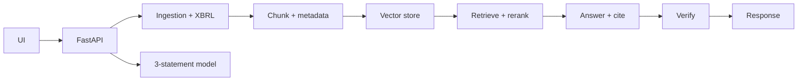

# FinLLM Research Agent

I got tired of pasting 10-Ks into chat tools and getting back confident-sounding answers with no source. This does the opposite: ingest a filing, ask a question, get an answer that points at the exact paragraph it came from.

Runs entirely on your machine by default. No API keys, no external calls. Ollama or any OpenAI-compatible model can be plugged in when you want prose answers instead of extracted snippets.

## What it does

- Loads the bundled NVIDIA 10-K sample, an SEC archive URL, a `.txt`, or a text-layer `.pdf`.
- Pulls Inline XBRL metadata and financial facts before chunking, so numerics stay structured.
- Retrieves and answers in three modes — `basic_rag`, `rag_rerank`, `self_verify` — and cites every claim.
- Verifies that each citation marker is actually supported by its chunk; redrafts if it isn't.
- Builds a source-backed three-statement scaffold and projects forward with a configurable growth rate.
- Scores itself with retrieval / citation / relevance / hallucination-proxy / latency / cost metrics.

## How the pipeline works



The default answerer is extractive — if the evidence doesn't say it, the answer doesn't say it. Boring on purpose.

## Run it

Backend:

```powershell
py -3 -m venv .venv-win
.\.venv-win\Scripts\python.exe -m pip install -r requirements.txt
.\.venv-win\Scripts\python.exe -m uvicorn api.main:app --host 127.0.0.1 --port 8010
```

Frontend:

```powershell
cd frontend
npm install
$env:VITE_API_BASE="http://127.0.0.1:8010"
npm run dev -- --host 127.0.0.1 --port 5180 --strictPort
```

Open `http://127.0.0.1:5180`, click the demo loader, start asking.

## Switch to a real LLM (Ollama)

```powershell
winget install Ollama.Ollama
ollama serve
ollama pull qwen2.5:7b-instruct

$env:FINLLM_LLM_PROVIDER="ollama"
$env:FINLLM_LLM_MODEL="qwen2.5:7b-instruct"
```

Restart the API. If the model errors, it falls back to extractive automatically.

For an OpenAI-compatible endpoint: `FINLLM_LLM_PROVIDER=openai-compatible` plus `FINLLM_LLM_API_KEY`.

## Docker

```powershell
docker compose -f infra/docker-compose.yml up --build
```

API on `:8000`, UI on `:5173`, persistent Chroma in the `finllm-storage` volume.

## Layout

```text
api/           FastAPI app + schemas
agent/         planner, workflow, tools, verifier
ingestion/     loaders, cleaning, chunking, SEC + XBRL
retrieval/     embeddings, vector stores, hybrid + reranker, citations
evals/         retrieval, citation, hallucination, cost, latency
finetuning/    RAFT + LoRA-format data
modeling/      three-statement scaffold + projection
frontend/      React + TypeScript workbench
infra/         Docker, AWS notes
```

## What it doesn't do

- The extractive default isn't a trained financial LLM.
- Self-verify checks citation behavior; it isn't a trained Self-RAG model.
- RAFT and LoRA generate data and simulated reports — real training compute isn't wired in.
- The three-statement model doesn't yet build debt, working-capital, depreciation, tax, share-count, or segment schedules.
- Scanned PDFs need OCR before ingest.
- The bundled eval is a regression fixture, not an expert-labeled benchmark.

Research software, not financial advice.
